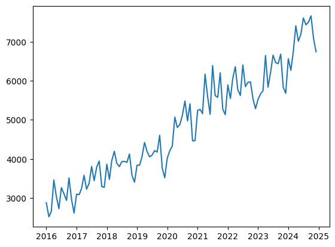
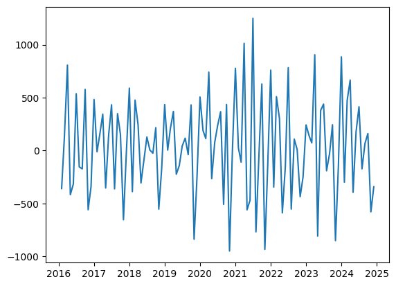
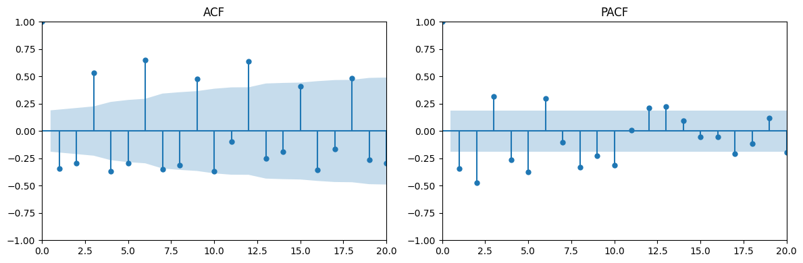
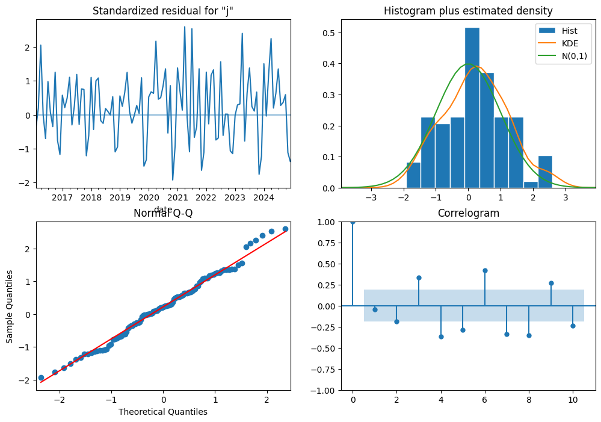
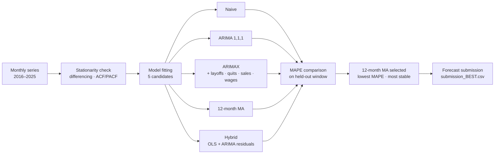

# Time Series Forecasting

Forecasting project from an MSBA Time Series class. Compared classical and
hybrid models on a monthly economic time series (with `layoffs`, `quits`,
`sales`, and `wages` as candidate exogenous regressors) to find the most
reliable forecast.

## Preview

Real notebook outputs from the analysis.



The raw monthly series spans **2016–2025** (~8 years). Clear upward trend with
strong seasonal swings — the kind of pattern where naïve forecasts already do
respectably and any model needs to beat the seasonal baseline.



After one differencing step the series is much closer to stationary (mean
reverts toward 0, variance stabilizes), motivating ARIMA(p, **1**, q).



ACF and PACF plots on the differenced series guided model order selection —
significant lags at 3, 6, 9, 12 hint at annual seasonality that ARIMAX with
exogenous regressors and the seasonal moving average can both capture.



ARIMA residual diagnostics: standardized residuals show no obvious structure,
the histogram + KDE roughly match N(0, 1), the Q-Q plot is close to linear,
and the correlogram shows minor remaining autocorrelation at lags 3 / 6 / 9 —
the seasonal signal a 12-month moving average ends up capturing more cleanly.

## Models Compared

| Model | Notes |
| --- | --- |
| Naive Forecast | Baseline — next value = most recent observation |
| ARIMA(1, 1, 1) | Standard ARIMA fit |
| ARIMAX(1, 1, 1) | ARIMA with four exogenous regressors: layoffs, quits, sales, wages |
| **12-Month Moving Average** | **Best model** — lowest MAPE, most stable forecasts |
| Hybrid (OLS + ARIMA on residuals) | Two-stage fit: linear trend + ARIMA on residuals |

## Why the 12-Month Moving Average Won

Smoothing over a full seasonal period captured the data's long-term pattern
without overfitting short-term noise. ARIMA and ARIMAX gave reasonable point
forecasts but had higher MAPE on held-out data. The hybrid added flexibility
but didn't beat the simpler average — a useful reminder that complexity isn't
always better, especially on series where the dominant signal is a clean
annual cycle.

## How It Works



**Notebook organization** (TimeSeriesFinalcode.ipynb):

| Section | What it does |
| --- | --- |
| Models + Best Model | Header listing the 5 models; highlights 12-month MA as the winner |
| Summary | Narrative comparison and reasoning behind the model selection |
| ARIMA model | Series plot, differencing, ACF/PACF, ARIMA fit, residual diagnostics |
| ARIMAX | Adds layoffs / quits / sales / wages as exogenous regressors |
| Naive + Moving Average | Baseline and the eventual winner |
| Hybrid | OLS trend fit + ARIMA on residuals |
| Submission output | Final 12-month MA forecast saved to `submission_BEST.csv` |

## Tech Stack

- **Python 3.10+**
- `pandas`, `numpy` — data handling
- `statsmodels` — ARIMA, ARIMAX, decomposition, residual diagnostics
- `pmdarima` — ARIMA order search
- `scipy`, `matplotlib` — stats utilities and visualization

## Data

The notebook expects a `train.csv` in the repo root (class-provided; not
committed here). Place it locally before running.

## Run It

```bash
pip install -r requirements.txt
jupyter notebook TimeSeriesFinalcode.ipynb
```

### Note: originally developed in Google Colab

The notebook uses `from google.colab import files` for data uploads. To run
locally, replace `files.upload()` calls with `pd.read_csv("train.csv")` after
placing the input data in the repo root.

## Files

| File | What it is |
| --- | --- |
| `TimeSeriesFinalcode.ipynb` | Main notebook — model fitting, comparison, diagnostics |
| `submission_BEST.csv` | Final submission (12-month moving average) |
| `submission_arima.csv`, `submission_ets.csv`, `submission_moving_average.csv`, `submission_stl_arima.csv` | Per-model forecast outputs |
| `12_month_moving_average_forecast.csv` | Best-model forecast values |
| `sample_submission.csv`, `test-2.csv` | Class-provided templates |
| `screenshots/` | PNG previews referenced in this README (extracted from notebook outputs) |
| `requirements.txt` | Pinned dependencies |

## License

[MIT](LICENSE)
